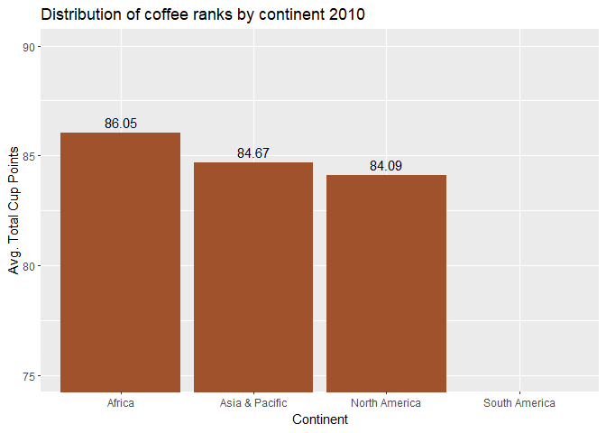

# Introduction

Nowadays there are large amount of coffee beans available in the online shops and supermarkets. In this wide selection it is easy to get lost, therefore the question for me in this exercise is how to choose in this great variety to have the best odds to pick a good quality coffee. Therefore my main goal in this exercise is to find the properties of the top ranked coffees, which can give me a hand in the selection process when I am standing in front of the shelves.

I will analyze Coffee Quality using a database shared on the tidytuesday challenge and was scraped from of the Coffee Quality Institution, a non-profit organization, which ranks the quality of coffee beans in their partner countries. The dataset contains the quality measurement of more than 1,100 different coffee beans from 35 countries. All the coffees included are qualified as specialty or premium coffees measured through strict criteria. The 10 quality of measurement are aroma, flavor, aftertaste, acidity, body, balance, uniformity, clean cup, sweetness, cupper points resulting the total cup points showing the overall quality of the coffee given on a 0-100 scale, which will be my key variable.

## Import Data 

```{r, warning=FALSE, message=FALSE}

library(data.table)
library(tidyverse)
library(knitr)


coffee_ratings <- as.data.table(readr::read_csv('https://raw.githubusercontent.com/rfordatascience/tidytuesday/master/data/2020/2020-07-07/coffee_ratings.csv')
)

```

## Data Cleaning and transformations

After importing the data I needed to do some data cleaning and transformation. I checked the variables with the skim function of the skimr package to see that there are several variables with missing values and extreme values. Therefore I decided to select my variables I want to analyze with few missing values. I selected species, country of origin, region, grading date, altitude in meters and the total cup points with the 10 quality of measurement.

I filtered out observations without country of origin or total cup points and observations with extreme altitude values above 5,000 meters, as they were probably not converted to meters or are typos. Finally I merged continents to the dataset from a csv I created to be able to show differences between continents coffee quality.

```{r, warning=FALSE, message=FALSE}

# Have a look at the data
#str(coffee_ratings)
# 
#skimr::skim(coffee_ratings)
# Plenty of missing values in several variables

# Keep main attribute variables with few number of missing values and all cup point attributes
coffee_ratings <- coffee_ratings %>%  select(c("species", "country_of_origin", "region", "grading_date", "altitude_mean_meters", 
                                               "total_cup_points", "aroma", "flavor", "aftertaste", "acidity", "body", "balance", "uniformity", "clean_cup", "sweetness", "cupper_points"))

# Check summary statistics
#summary(coffee_ratings)
# There are some outliers

# Remove observations without country name and observations without evaluation or extreme altitude
coffee_ratings <- filter(coffee_ratings, country_of_origin != "NA",
                         total_cup_points > 0,
                         altitude_mean_meters < 5000)

# Convert Grading date to date format and create grading year
library(lubridate)
coffee_ratings <- coffee_ratings %>%  mutate(grading_date = mdy(coffee_ratings$grading_date))
coffee_ratings <- coffee_ratings %>%  mutate(grading_year = year(coffee_ratings$grading_date))

# Add continents to data
continents <- read_csv("https://raw.githubusercontent.com/ASerfozo/Coding_in_R/main/Task_7_coffee_quality/continents.csv")
coffee_ratings <- merge(coffee_ratings, continents, all.x = TRUE, by.x = "country_of_origin", by.y="Country")

# Rename countries
coffee_ratings$country_of_origin[coffee_ratings$country_of_origin == "Cote d?Ivoire"] <- "Ivory Coast"
coffee_ratings$country_of_origin[coffee_ratings$country_of_origin == "Tanzania, United Republic Of"] <- "Tanzania"
coffee_ratings$country_of_origin[coffee_ratings$country_of_origin == "United States"
                                 | coffee_ratings$country_of_origin == "United States (Hawaii)"
                                 | coffee_ratings$country_of_origin == "United States (Puerto Rico)"] <- "USA"


```

# Exploratory Data Analysis

To have a basic understanding about the dataset, I had a look at the summary statistics and histograms of all numeric variables. The results can be found below. It is easy to notice the lack of variety in the distribution of clean cup points, sweetness and uniformity metrics of coffees. The other variables are better for making difference between the different coffee types.  

```{r, warning=FALSE, message=FALSE}

# Re-check Summary statistics
#summary(coffee_ratings)

# Quick check on all histograms
coffee_ratings %>%
  keep(is.numeric) %>% 
  gather() %>% 
  ggplot(aes(value)) +
  facet_wrap(~key, scales = "free") +
  geom_histogram(color = "black", fill = "Sienna")+
  theme_bw()

```

Finally, I also had a look at the correlation of the evaluation variables. There were some interesting outcomes from the correlation matrix, the matrix can be found below. The strongest correlation was between aftertaste and flavor of a coffee, which is quite reasonable. Also we can see that the flavor of a coffee is the most important factor as it has more than 0.7 correlation impacting several other metrics of a coffee like aftertaste, acidity, balance and cupper points.

```{r, warning=FALSE, message=FALSE}

# Group ranking attributes
evaluation <- coffee_ratings %>%  select(c("aroma","flavor","aftertaste","acidity","body","balance","uniformity","clean_cup","sweetness","cupper_points"))

# Check their correlation
library(GGally)
ggpairs(evaluation)

```

# Analysis

So let's have a look at the main attributes to help us how to select a coffee online or in a store if we have time to go through these details.

### Arabica vs Robusta

First, let's see which species of coffee is the better, arabica or robusta. The results can be found below on the boxplot

```{r, warning=FALSE, message=FALSE}

# Arabica vs Robusta boxplot
ggplot(coffee_ratings, aes(factor(species),total_cup_points)) + 
  geom_boxplot(color = "black", fill = c("Sienna","Peru")) +
  labs(title = "Distribution of coffee ranks by species", x = "Species", y = "Avg. Total Cup Points")
```

We can see that the cup points of arabica coffees have a larger variance compared to robusta, it is easier to select a specialty or choose a relatively bad coffee in case of arabica. However, it is also important to have a look at the number of observations of each type below, where we can found that the number of robusta coffees were negligible compared to arabica in the experiment, which maybe explains the difference in variance.

```{r, warning=FALSE, message=FALSE}
# Number of observations in the two category
species_table <- coffee_ratings[,list(observations = .N, avg_tot_cup_points = round(mean(total_cup_points),2)), by = species]

knitr::kable(species_table, caption="Arabica vs Robusta avearge total cup points")

```

### Best continent choice regarding overall coffee quality

In the next attribute we would like to check which continent has the best coffee in average. Below we can see that selecting an African coffee or a South American one can be a "safe choice", it is not a coincidence that we often hear that these continents have the best coffees, however it is important to notice that APAC and North America have also got highly valued coffees. But in case of North American coffee we have a better change to touch a lower qualtiy according to the plot.

```{r, warning=FALSE, message=FALSE}

ggplot(coffee_ratings, aes(factor(Continent),total_cup_points)) + 
  geom_boxplot(color = "black", fill = c("Sienna", "Peru", "Burlywood", "Wheat")) +
  labs(title = "Distribution of coffee ranks by continent", x = "Continent", y = "Avg. Total Cup Points")
```

Let's have a look at the African versus South American coffee competition. We can see that the difference on average is very little between the two.

```{r, warning=FALSE, message=FALSE}
afr_vs_southam <- coffee_ratings[Continent == "Africa" | Continent == "South America",list(observations = .N, avg_tot_cup_points = round(mean(total_cup_points),2)), by = Continent][order(-avg_tot_cup_points)]
knitr::kable(afr_vs_southam, caption="Africa vs South America coffee quality")

```

### Quality during time

We can also see that based on the Coffee Quality Institute data, during time there were a large difference in the continents coffee quality according to the graders, so year of harvest can be critical regarding quality. Africa is usually the number one regarding coffee quality, especially in the year of 2016 and 2018. We can also see that the best year of harvests are very different for the different continents, which is probably impacted by the extreme weather conditions in some of the years.

```{r, warning=FALSE, message=FALSE}

point_year <- coffee_ratings[, list( avg_tot_cup_points = mean(total_cup_points)), by = list(Continent, grading_year)]

ggplot(point_year, aes(grading_year,avg_tot_cup_points, group = Continent, color = Continent)) + 
  geom_line(size = 1) +
  scale_color_manual(values = c("Sienna", "Peru", "Burlywood", "Wheat")) +
  labs(title = "Average Total cup points of continents by year of grading", x = "Grading Year", y = "Avg. Total Cup Points")
```

Let's have a look at the overall coffee quality by year on an animated chart to see it from another perspective. The animation highlights even better the significant drop in coffee quality during the year of 2011, 2013 and 2017. 

```{r, warning=FALSE, message=FALSE, results=FALSE}

# Animated chart
library(gganimate)

animated <- ggplot(point_year, aes(x = Continent,y = avg_tot_cup_points)) + 
  geom_col(fill = c("Sienna")) +
  transition_states(grading_year) +
  geom_text(aes(label = round(avg_tot_cup_points,2)), vjust = -0.5)+
  coord_cartesian(ylim = c(75,90)) +
  labs(title = "Distribution of coffee ranks by continent {closest_state}", x = "Continent", y = "Avg. Total Cup Points")


anim_save("animated.gif", animated)

```


### Top Ranked countries regarding best overall coffee quality

The most interesting attribute is the country of origin, which country is the best choice if we want to select a top quality coffee in a store? The results can be found below.

```{r, warning=FALSE, message=FALSE}

country_ranking <- coffee_ratings[,list(observations = .N, avg_tot_cup_points = round(mean(total_cup_points),2)), by = country_of_origin][order(-avg_tot_cup_points)]
knitr::kable(head(country_ranking, 10), caption="Top 10 countries regarding coffee quality")
```

So we can see that selecting an Ethiopian coffee is the best what we can do as these have an especially good ranking according to the evaluation of 30 Ethiopian coffees. They achieve an average of 85.9 total cup points.

It is also very interesting to see that Papua New Guinea and Japan is in the top 3, however they only have 1 observed coffee which is not enough to state that these countries are one of the the top quality coffee producers. As a results, let's have a look at the top 10 countries with more than 5 observed type of coffee. The results can be found below and now one of the most well known coffee producer Brasilia have also entered the top 10 list. African countries are well-represented in the top5 with countries like Ethiopia (well above the other countries), Kenya and Uganda. For me the USA and China were a surprise in the top 10 as I was not familiar with their coffee producing capabilities.

```{r, warning=FALSE, message=FALSE}
# Considering only countries with more than 5 observed coffee type
#country_ranking[observations>5,]
knitr::kable(head(country_ranking[observations>5,], 10), caption="Top 10 countries regarding coffee quality with more than 5 observed type of coffee")
```

### Best altitude for a coffee plantation

If someone would like to dig deeper in selecting the properties of a top quality coffee, they can still have a look at the best altitude of a coffee farm. On the bar chart below we can see the line representing the average coffee quality of the 1,100 observed coffee. We can notice that coffees grew around the altitude of 2,000 are providing a better quality by a good chance. 

```{r, warning=FALSE, message=FALSE}

point_altitude <- coffee_ratings[, list( avg_tot_cup_points = mean(total_cup_points)), by = round(coffee_ratings$altitude_mean_meters, -2)]

ggplot( point_altitude , aes(x = round , y = avg_tot_cup_points)) +
  geom_col(fill='Sienna') +
  coord_cartesian(ylim = c(70,90)) +
  geom_abline(slope=0, intercept=mean(coffee_ratings$total_cup_points),  col = "navyblue",lty=2) +
  labs(y="Avg. Total cup points", x = "Altitude in meters", title="Coffee quality versus above sea level altitude in meters")

```

### Finally, the best coffee (region)

Finally, if we would like to order one of the best coffees in the world based on graders data, doing a well organized Google search on the coffee regions below combined with the attributes we just discussed, is a good thing we can do. There is a high probability based on the Coffee Quality Institution data, that we will find a top quality treasure.

```{r, warning=FALSE, message=FALSE}

# Best coffees (regions)
region_ranking <- coffee_ratings[,list(observations = .N, avg_tot_cup_points = round(mean(total_cup_points),2)), by = list(country_of_origin, region)][order(-avg_tot_cup_points)]

# Top coffee (region)
#head(unique(region_ranking),20)
#knitr::kable(head(unique(region_ranking),10), caption="Top 10 coffee regions to look for")

# Top coffee (region) with at least 3 observed coffee
#head(unique(region_ranking[observations>2,]),20)
knitr::kable(head(unique(region_ranking[observations>2,]),10), caption="Top 10 coffee regions with at least 3 observed coffee")
```

# Summary

So we went through many attributes of a top quality coffee to help us in the selection at a store or in case of an online webshop. Based on the results the safe choice is an arabica coffee from Africa or South America, especially a coffee from Ethiopia, Kenya, Uganda, Colombia or Brasilia.

But if we want to find top quality here are the attributes we should look after according to my opinion. An arabica coffee from Africa, especially Ethiopia or Kenya, with a harvest of 2016 or 2018 and an altitude around 2,000 meter of the coffee plantation where it comes from. Mentioning coffee plantations, do not forget to look for "guji-hambela", "oromia" or "sidamo" regions in case of Ethiopian coffee or "central kenya" or "nyeri" region of Kenyan coffee. Hopefully, you will not regret it.


